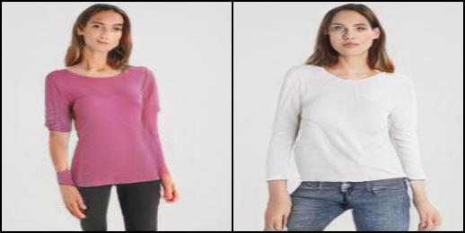
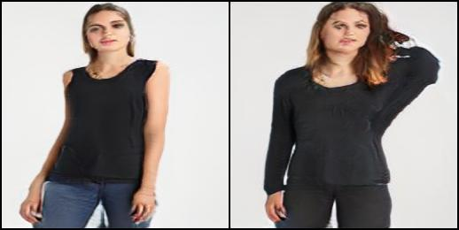
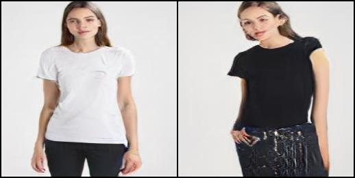
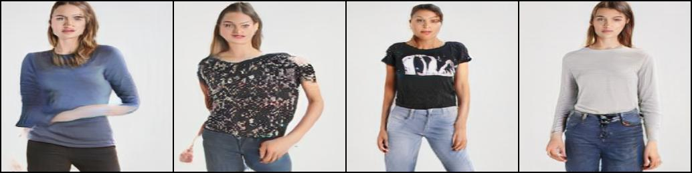
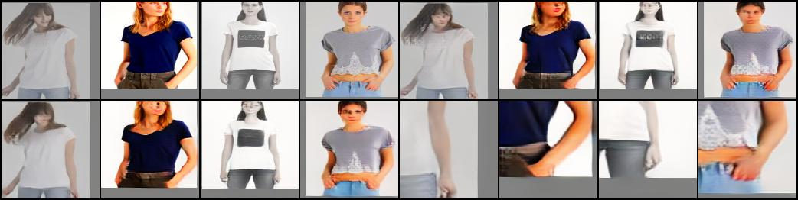

# Fashion_FastGAN
This is the project which uses FastGAN to generate images for virtual try-on clothing.

The results I got are still not good enough, so more improvement is needed in the future to complete this project.

My project is built up based on [FastGAN](https://github.com/odegeasslbc/FastGAN-pytorch).
Here are some results:
Generated images:
 

Reconstructing images of discriminator:

